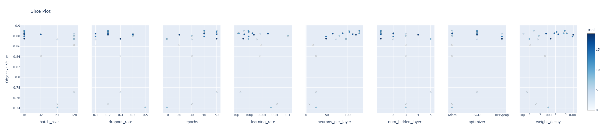

# FashionMNIST Classification with PyTorch

A deep learning project for classifying FashionMNIST clothing images using Artificial Neural Networks (ANNs) in PyTorch.

---

## Project Overview

This project explores the **FashionMNIST dataset** (70,000 grayscale images of clothing items across 10 categories) and implements neural network models to classify images accurately. The focus was on learning the **foundations of deep learning with PyTorch**, experimenting with model architectures, and optimizing performance.

---

## Summary of Approach and Results

**Data Preparation**

* Loaded and explored the FashionMNIST dataset (train/test split).
* Normalized image pixel values for stable training.
* Visualized dataset samples for category distribution.

**Modeling & Training**

* Implemented a fully connected ANN from scratch using **PyTorch’s `nn.Module`**.
* Designed and trained models with different architectures (1–3 hidden layers).
* Experimented with activation functions (ReLU, Sigmoid).
* Used **CrossEntropyLoss** as the loss function and **SGD/Adam optimizers**.

* Automated hyperparameter tuning using **Optuna** with **Bayesian optimization** for improved model performance.

**Evaluation**

* Achieved classification accuracy on the test set (~85% baseline ANN).
* Visualized **loss curves** and **accuracy trends** during training.
* Performed **error analysis** by plotting misclassified examples.

**Key Implementations**

* Built **custom training loops** with `DataLoader`.
* Integrated **GPU acceleration** for faster training.
* Experimented with **weight initialization** strategies.
* Applied **early stopping** and hyperparameter tuning (learning rate, batch size, hidden units).

* Leveraged **Optuna** for systematic hyperparameter search and optimization.

---

## Visualizations

Some outputs generated during the project:

### Dataset Sample Visualization


### Training Loss & Accuracy Curves


### Hyperparameter Importance


### Slice Plot (Error Analysis)


---

## Installation

```bash
git clone https://github.com/kushalregmi61/fashion-mnist-classification.git
cd fashion-mnist-classification
pip install -r requirements.txt
```

---

## Usage

1. Run the data loading notebook to explore FashionMNIST.
2. Train the ANN model using the training script.
3. Evaluate model performance on the test set.
4. Visualize predictions, losses, and misclassifications.

---

## Project Structure

```
fashion-mnist-classification/
├── README.md
├── requirements.txt
├── .gitignore
├── data/
│   └── fashion-mnist.csv
├── notebooks/
│   └── mnist-fashion-classification.ipynb
├── outputs/
│   ├── dataset_image.png
│   ├── hyperparameters_importance.png
│   ├── optimization_history_plot.png
│   └── sliceplot.png
```

---

## License

This project is licensed under the MIT License - see the LICENSE file for details.

---

## Links

* [Main Fellowship Repository](https://github.com/KushalRegmi61/AI_Fellowship_FuseMachines)

* [FashionMNIST Dataset](https://github.com/zalandoresearch/fashion-mnist)


